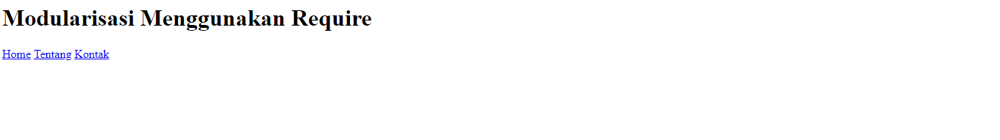
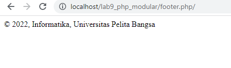
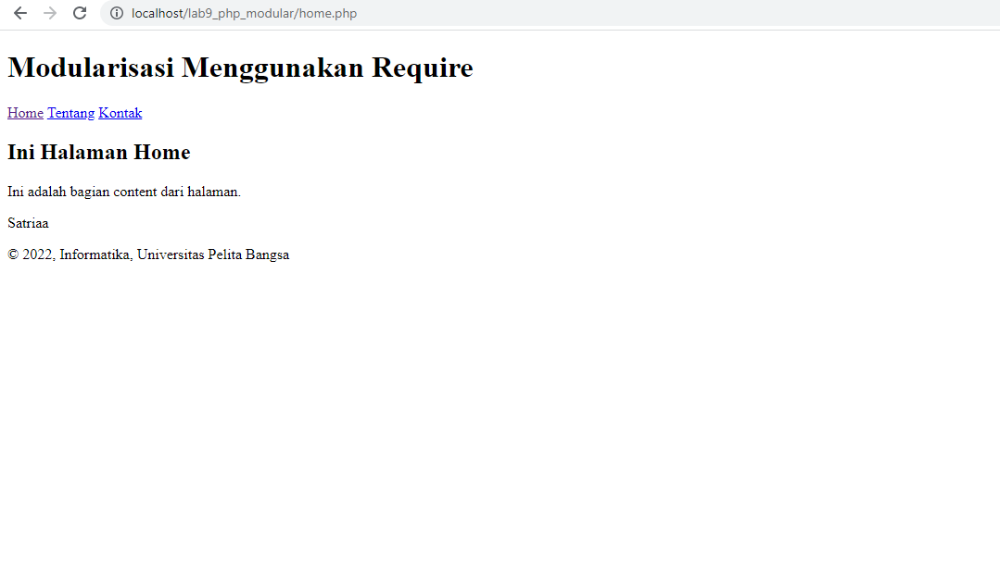
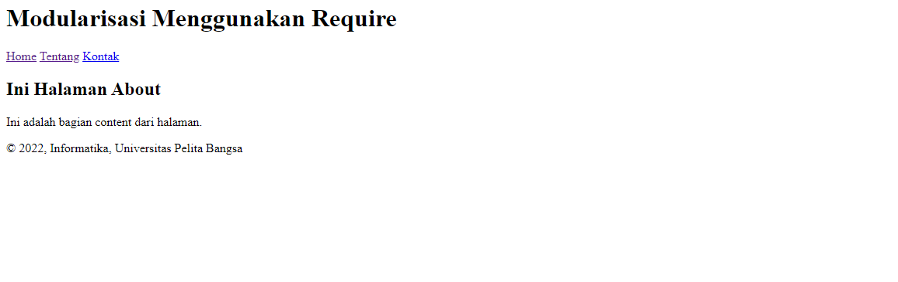

## MUHAMMAD SAFRI SATRIA PERMANA
## 312010337
## PEMROGRAMAN WEB
## TI.20.A.2

## LAB 9 WEB

## LANGKAH PERTAMA BUAT FILE BARU DENGAN NAMA **header.php**

Membuat header require

## LANGKAH KEDUA BUAT FILE **footer.php**

Membuat footer dengan require

## LANGKAH KETIGA BUAT FILE **home.php**

ini adalah tampilan home dengan modular require

## LANGKAH KEEMPAT BUAT FILE **about.php**

ini adalah tampilan pada about

--------------------------------------------------------------------------------------------------